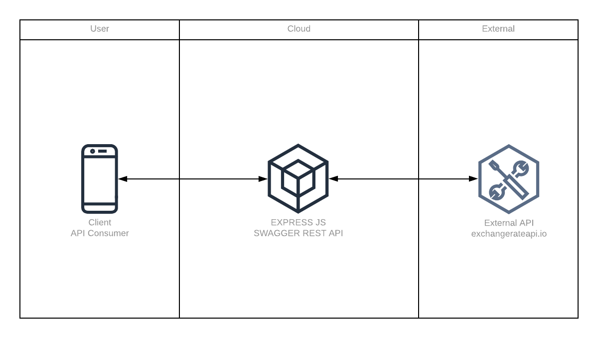

# Currency Exchange - Best Practices building a world class Node.js microservice

This code pattern shows you how to create a world class currency conversion microservice in Node.js. This code pattern is a microservice

This pattern showcases modern Node.js development by using modern JavaScript and popular `npm` libraries, which are listed in the [Anatomy of this Application](#anatomy-of-this-application) section at the bottom of this page.

This application was created using test-driven development(TDD) methodologies, in particular the Red-Green-Refactor or test-first approach. No code was written without **_first_** writing an associated unit test.

Code that has unit tests is regarded as more complete and accurate. The unit tests function as a means to clearly understand the application. Requirements for the application translate into tests, so examining the tests gives you an idea about what the application does, and it also shows how to use the code. For our unit tests we use [Jest](https://jestjs.io/), a JavaScript unit-test framework testing library that works well with TDD.

## After following this code pattern, you will understand how to:

- Design and create a Node.js microservice with a REST interface that has a swagger test harness where you can manually inspect, discover, and run the various API endpoints.
- Use and run this simple microservice.
- Use the code base as a reference architecture and toolchain to create your own Node.js microservices.
- Deploy and run this microservice on Kubernetes.

## Architecture

This flow is for the runtime of the currency conversion microservice.



**_Figure 1. Production flow_**

1. Client API Consumer calls the microservice over the internet (http/s request).
1. ExpressJS `web server` accepts the REST request (e.g. GET /convertCurrency/ZAR/USD/600.66).
1. Code routing in Express passes the request to a service module which in turn calls the External European Currency Exchange API (http://api.exchangeratesapi.io).
1. An exchange rate for ZAR is retrieved and stored. The value of 600.66 South African Rands (ZAR) is converted to US Dollars(USD).
1. The ExpressJS `web server` sends a response to the calling consumer with the dollar amount (in this case, \$40.59 ).

## Included components

- [Swagger](https://swagger.io/): A framework of API developer tools for the OpenAPI Specification that enables development across the entire API lifecycle.

## Featured technologies

- [Node.js](https://nodejs.org/): Node.js is a JavaScript framework which has an awesome package manager called `npm` that lets you build applications with components built and supported by an active open source community.
- [Express](https://expressjs.com/): Fast, unopinionated, minimalist web framework for Node.js.
- [Axios](https://www.npmjs.com/package/axios): Promise based HTTP client for the browser and Node.js.
- [csvtojson](https://www.npmjs.com/package/csvtojson): A node module is a comprehensive nodejs csv parser to convert csv to json or column arrays
- [esm](https://www.npmjs.com/package/esm): The brilliantly simple, babel-less, bundle-less ECMAScript module loader.
  <details><summary><strong>Why JavaScript Modules?</strong></summary>

> Modules in JavaScript are really great feature in the latest version of the language. Unfortunately it's not supported in earlier versions of Node.js ( < ver 13.2.x )

> So in order to use these new features you'll need a transpiler to generate plain old JavaScript for now.

> we recomment `esm` which is the world’s most advanced ECMAScript module loader. This fast, production ready, zero dependency loader is all you need to support ECMAScript modules in Node 6+.

> See the release [post](https://medium.com/web-on-the-edge/tomorrows-es-modules-today-c53d29ac448c) for details!

</details>

# Prerequisites

You need to have the following installed to complete the steps in this code pattern:

For running these services locally without Docker containers, you need:

- [Node.js v10 or later](https://nodejs.org/en/download/)
  <details><summary><strong>Tip: Use Node Version Manager (nvm)</strong></summary>

> nvm is a simple bash script to manage multiple active Node.js versions.

> We recommend using `Node Version Manager (NVM)` to control the version of Node.js that you use.

> Why? The system or operating system installed Node.js version is fixed. You may need different versions of Node for other projects.

> NVM allows you to choose and switch to the version of Node.js that suits your needs.

> Install via command line:

```sh
curl -o- https://raw.githubusercontent.com/nvm-sh/nvm/v0.35.2/install.sh | bash
```

[Learn more about NVM](https://github.com/nvm-sh/nvm) and find the latest installation instructions.

</details>

- [Relevant Node.js packages](package.json): Use `npm install`

### This code pattern was built 100% TDD and has 100% test coverage.

We use Jest as our unit test framework. Jest uses the popular `describe`, `it`, and `expect` syntax

Remember to use mock data so that your tests don't fail because of changing data.

This pattern includes neat developer productivity tools:

1. linting and formatting NPM scripts

You can call it by running `npm run lint`. You can use the `prettier` formatter which can be run with `npm run format`.

The unit tests we run in this pattern are run in the deployment pipeline

# Steps

Follow these steps to set up and run this code pattern locally. The steps are described in detail below.

### 2. Run the application locally

1. Install packages with NPM by running `npm install`.
2. Start the app by running `npm start`.
3. Browse the API from your browser `localhost:4001`.

> Note: The server host can be changed as required in the server.js file, and `PORT` can be set in the `.env` file.

## Anatomy of this application

These are the key components of this microservice.

- **Jest for unit testing**

  - Use Jest `mocks` to run unit tests locally without side effects. Examples of side effects include:
    _ Calling external services (like other Web APIs) that are changed or offline; for example, the World Bank currency exchange API that our microservice wraps.
    _ Calling external databases that are in-flux or down \* Using time stamps and random ID generation that are non-deterministic, so they're not good for test data that may be generated on the fly (Mocks really shine here and provide expected reliable values that tests your business logic).
  - Hot code reloading (aka On page save hooks) run tests automatically on save by running `Jest -watch`.

- **Pino for logging**

  - A best practice is to have a logging framework to extract good errors from your application, as console.log is not always sufficient.

  - [Pino](https://github.com/pinojs/pino) is a great simple tool to use logging framework.

- **Code formatting**

  - [Prettier](https://prettier.io/) for code formatting.

- **JavaScript syntax checking**

  - [ESLint](https://eslint.org/) helps you find and fix problems in your JavaScript code.

- **Git pre-commit hooks**
  Every time you run `git commit ...` both the linter and formatter will run. If, for example, you have extra spaces in your code like `const planet = " Saturn ";`, the formatter automatically cleans up the code and formats it correctly to be `const planet = "Saturn";`. This newly formatted code is then committed and can be pushed. However, say you have a syntax error, for example `cnst planet = "Saturn";`, the commit will fail as the symbol `cnst` is invalid. You will see informative output in your console as Figure 3 shows. Once you have manually corrected the syntax error, you can recommit it until the syntax is correct and the linter passes.


**_Figure 3. Syntax error caught by Git pre-commit hooks with both linter 1 (ESLint) and formatter 2 (Prettier)_**

This is achieved with the two `npm` libraries `lint-staged` and `husky`, which are installed by running `npx` as such:

    ``` sh
        npx mrm lint-staged
    ```

You will see the following automatically appended to the `package.json` file:

`json "husky": { "hooks": { "pre-commit": "lint-staged" } }, "lint-staged": { "*.js": "eslint --cache --fix", "*.+(js|json)": "prettier --write" }`

- [`esm`](https://www.npmjs.com/package/esm)

  - The brilliantly simple, babel-less, bundle-less ECMAScript module loader.
  - A lightweight **JavaScript Transpiler** alternative to `babel`
  - Allows you to use modern JavaScript for example: `modules` with `import` and `export` rather than the older `requires()` methods to link packages

- [`rimraf`](https://www.npmjs.com/package/rimraf)

  - Cleanup previous builds and distributions
    - rimraf is The UNIX command `rm -rf` for **_node_**

- **`swagger`**
  - Installing the npm package `swagger-ui-express` lets you create a REST API with a well-documented test harness with almost no effort at all, giving your microservice that professional and polished look as well as a useful way to manually test the API from a swagger html test harness.
